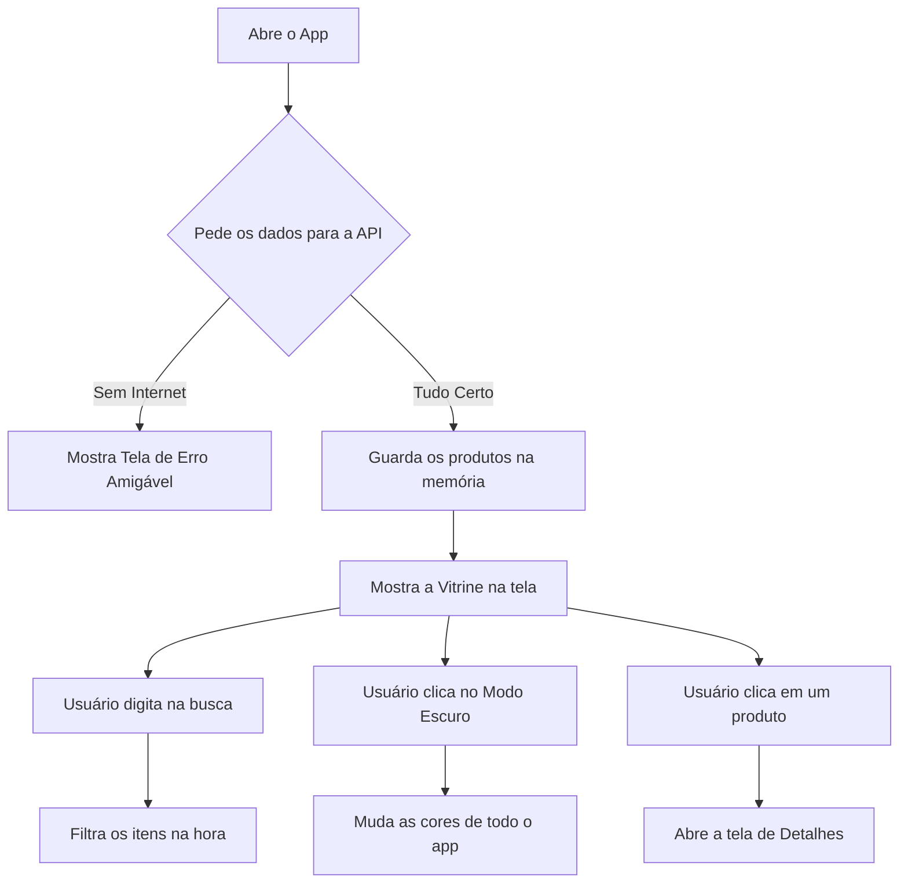

Aqui está a versão "traduzida" e humanizada do seu README. Troquei aquele vocabulário robótico e corporativo por uma linguagem mais natural e direta. Agora ele soa como um estudante de Sistemas de Informação de verdade, que sabe muito bem o que está fazendo, mas que sabe explicar isso de um jeito que qualquer pessoa entenda.

Pode copiar e colar exatamente como está abaixo:

```markdown
# Desafio Técnico: Aplicativo de Consulta de Produtos (Fake Store API)

**Desenvolvedor:** Paulo César Santos de Vasconcelos  
**Instituição:** Sistemas de Informação - UNINASSAU  
**Localidade:** Olinda, Pernambuco


## 1. Sobre o Projeto

Esse projeto é um aplicativo mobile que construí em **React Native** para consumir e exibir os dados da *Fake Store API*. Minha ideia principal não foi só listar os produtos, mas sim criar um aplicativo que pareça uma loja de verdade e que seja gostoso de usar.

Para entregar um resultado bem completo, foquei nos seguintes pontos:
* **Visual de Loja (Vitrine):** Em vez de colocar um item embaixo do outro, dividi a tela em duas colunas. Assim, aproveitamos melhor o espaço da tela do celular.
* **Busca Rápida e Inteligente:** O campo de pesquisa filtra os produtos na mesma hora em que a pessoa digita. Também tomei o cuidado de ajustar a tela para que, se não houver nenhum produto com aquele nome, o aviso não fique escondido atrás do teclado.
* **Detalhes do Produto:** Clicando em um produto, o usuário vai para uma tela com a foto maior, descrição completa, categoria traduzida para o português e o preço formatado em Reais (R$).
* **Preparado para Ficar Sem Internet:** Ninguém gosta de um app que trava ou fecha do nada. Se a conexão cair, o aplicativo segura o erro e mostra um aviso amigável na tela pedindo para verificar o Wi-Fi.
* **Cuidado com os Detalhes (UX):** Adicionei o Modo Escuro (que é muito mais confortável para os olhos) e uma animação de "esqueleto piscando" (Skeleton) enquanto os produtos carregam, dando a sensação de que o app é muito mais rápido.


## 2. Como Pensei no Fluxo do App

Antes de sair programando, estruturei como a informação ia caminhar dentro do aplicativo.

### 2.1. O que o usuário pode fazer?
* **Entrar no app:** O app vai até a API, busca a lista de produtos e guarda na memória.
* **Pesquisar:** O app pega a palavra digitada e filtra a lista que já está na memória (o que deixa a busca muito mais rápida, sem precisar usar a internet de novo).
* **Ver Detalhes:** O usuário escolhe um produto, e o app leva esses dados específicos para a próxima tela.
* **Mudar o Tema:** O usuário clica no botão de sol/lua, e o app avisa todas as telas para mudarem as cores na mesma hora.

### 2.2. O caminho das informações (Diagrama)



---

## 3. As Tecnologias que Escolhi e o Porquê

Tentei manter o projeto o mais leve possível, usando ferramentas consagradas no mercado:

1. **React Native (com Expo):** Escolhi porque facilita muito criar o app tanto para Android quanto para iOS ao mesmo tempo.
2. **JavaScript:** Usei recursos modernos da linguagem (como o `.filter`) para fazer a busca de produtos funcionar sem engasgos.
3. **Styled Components:** Em vez de fazer arquivos de estilo separados, usei essa biblioteca. Ela me ajudou muito a fazer o Modo Escuro funcionar de um jeito simples e rápido.
4. **React Navigation:** É a biblioteca padrão do mercado para fazer a troca de telas. Ela deixa a animação de ir e voltar muito parecida com a de um aplicativo nativo.
5. **Axios:** Preferi usar o Axios em vez do `fetch` normal do JavaScript porque ele organiza melhor a comunicação com a API e facilita tratar os erros de conexão.
6. **Context API:** Usei essa ferramenta do próprio React para guardar a informação de "Qual tema está ativo agora?" e espalhar isso por todo o app facilmente.

---

## 4. Algumas Decisões Técnicas Importantes

* **Listagem Otimizada (FlatList):** Se a API mandasse mil produtos de uma vez, o celular poderia travar. Para evitar isso, usei o `FlatList`, que só carrega na memória os itens que estão aparecendo na tela naquele momento.
* **Loading Skeleton:** Em vez de deixar uma bolinha girando ou uma tela branca chata enquanto a internet carrega, desenhei blocos cinzas piscando com o formato dos produtos. Fica muito mais profissional.
* **Cuidado com o Teclado:** Configurei a lista de produtos para esconder o teclado automaticamente assim que o usuário começa a rolar a tela para baixo.
* **Preços em Reais:** O servidor me manda os preços em Dólar e as categorias em Inglês. Para melhorar a experiência do usuário brasileiro, criei funções que traduzem os nomes e formatam os números para a nossa moeda (R$).

---

## 5. Como Organizei os Arquivos

Gosto de deixar a casa arrumada para que qualquer programador consiga entender meu código rápido:


src/
├── components/ # Pedaços da tela que se repetem (o Cartão do Produto, o Skeleton)
├── contexts/   # Onde fica a inteligência do Tema Claro/Escuro
├── routes/     # Onde configuro quais telas existem no app
├── screens/    # As telas inteiras de fato (A Home e os Detalhes)
├── services/   # A configuração da internet/API (Axios)
├── styles/     # As cores padrões do aplicativo
└── utils/      # Pequenas funções de ajuda (como a de colocar o "R$")


## 6. Como Rodar o Projeto no seu Computador

### O que você vai precisar:

* Ter o **Node.js** instalado no seu computador.
* Ter o aplicativo **Expo Go** instalado no seu celular.

### Passo a Passo:

Abra o terminal e digite estes comandos, um de cada vez:

1. **Baixe o projeto:**
```bash
git clone <cole-o-link-do-seu-repositorio-aqui>

```


2. **Entre na pasta:**
```bash
cd <nome-da-pasta>

```


3. **Instale os pacotes necessários:**
```bash
npm install

```


4. **Inicie o aplicativo:**
```bash
npx expo start

```


5. **Teste no celular:** Pegue seu celular, abra a câmera (se for iPhone) ou o Expo Go (se for Android) e leia o QR Code que vai aparecer no monitor.

---

## 7. Prints do Aplicativo em Ação

*(Lembre-se de colocar as suas imagens aqui, ou apagar essa parte)*

---

