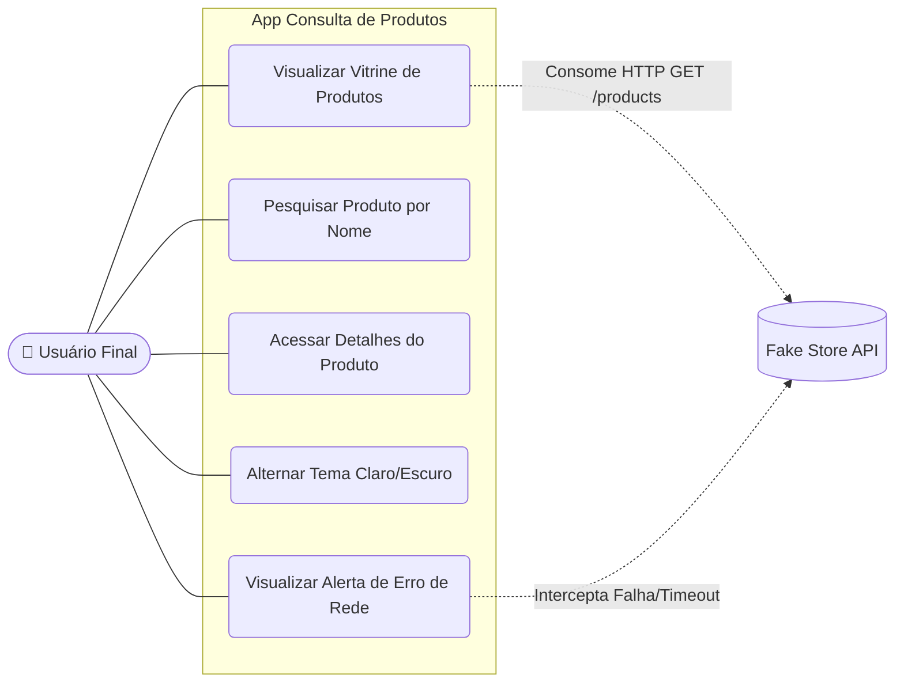
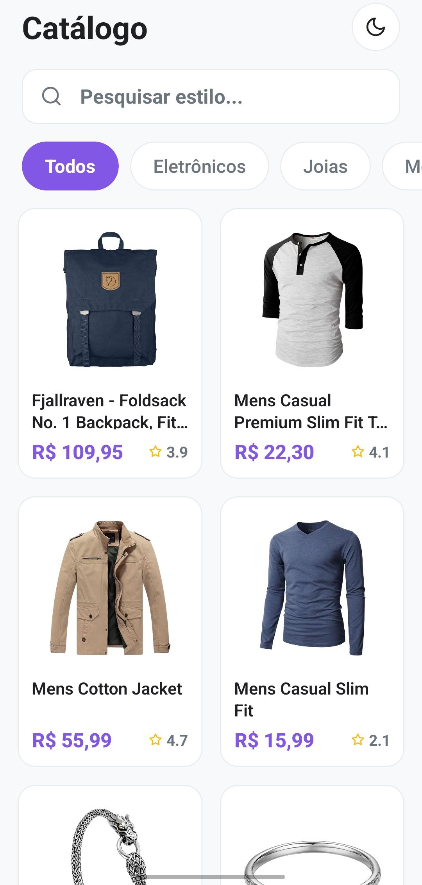
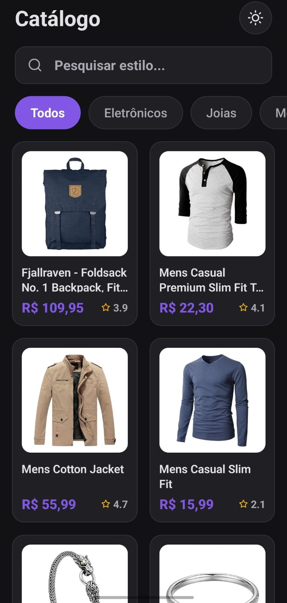
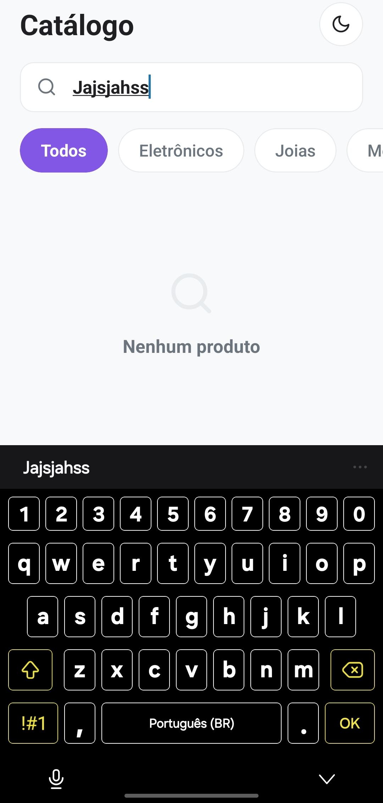
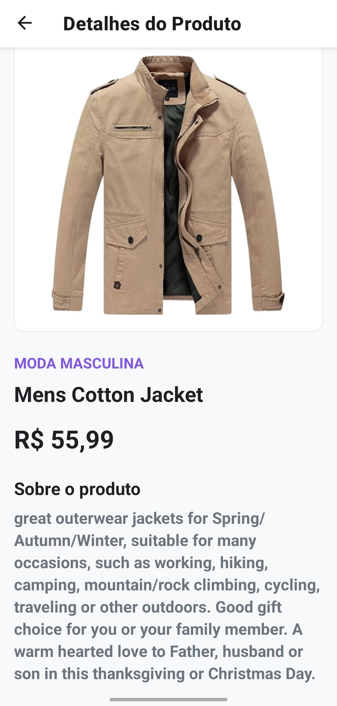
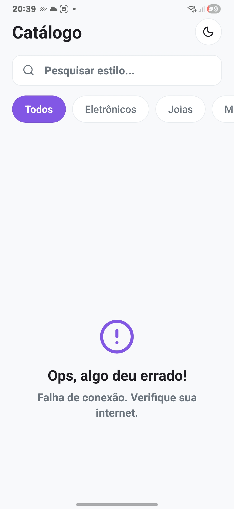

# Documentação do Projeto: Aplicativo de Consulta de Produtos

## Nome do candidato
**Paulo César Santos de Vasconcelos**


## Descrição do projeto
Este projeto consiste no desenvolvimento de um aplicativo mobile em React Native focado no consumo e exibição de dados da *Fake Store API*. O objetivo central foi entregar uma solução funcional e com alto padrão de usabilidade, assemelhando-se a um produto real pronto para o mercado.

As principais funcionalidades implementadas incluem:
* **Catálogo Dinâmico:** Listagem dos produtos em um layout de vitrine responsivo com duas colunas.
* **Busca em Tempo Real:** Mecanismo de filtragem instantânea no lado do cliente, retirando requisições desnecessárias à API.
* **Visualização Detalhada:** Telas de detalhes com formatação contextualizada.
* **Resiliência de Rede:** Tratamento ativo de erros de conexão para evitar travamentos ou fechamentos inesperados do aplicativo.

Para ilustrar o escopo do projeto, o Diagrama de Casos de Uso abaixo mapeia as interações mapeadas entre o usuário final, as funcionalidades do sistema e o serviço externo:



## Tecnologias utilizadas

A arquitetura e as ferramentas foram definidas visando performance, manutenibilidade e alinhamento com os padrões da indústria:

* **React Native & Expo:** Escolhidos pela agilidade no desenvolvimento multiplataforma e fluidez nos testes físicos.
* **JavaScript:** Linguagem base, utilizando métodos funcionais avançados para manipulação de dados na busca.
* **React Navigation (Native Stack):** Selecionado para garantir roteamento nativo, proporcionando transições limpas entre as telas.
* **Axios:** Cliente HTTP adotado por oferecer melhor controle sobre interceptações e limites de tempo (*timeout*) nas requisições.
* **Styled Components:** Utilizado para encapsular a estilização (CSS-in-JS) e gerenciar dinamicamente a troca de design do sistema.
* **Context API:** Solução nativa do React empregada para o gerenciamento de estados globais (como a alternância de Tema), evitando o acoplamento de bibliotecas externas complexas.

## Como executar o projeto

Para compilar e rodar a aplicação em ambiente local, é necessário possuir o Node.js instalado e o aplicativo Expo Go no smartphone.

1. **Clone o repositório:**

```bash
git clone https://github.com/pcsdv0/teste-tecnico-mobile.git
```

2. **Acesse a raiz do projeto:**

```bash
cd teste-tecnico-mobile

```

3. **Instale as dependências:**

```bash
npm install

```

4. **Inicie o Metro Bundler (Servidor):**

```bash
npx expo start

```

5. **Teste em ambiente físico ou emulado:** Escaneie o QR Code gerado no terminal com o aplicativo Expo Go para visualizar o app no celular, ou pressione a tecla `a` no terminal para rodar via emulador Android.

## Estrutura de pastas

A hierarquia foi desenhada utilizando princípios de separação de responsabilidades para facilitar a manutenção do código:

```text
src/
├── components/ Componentes de interface reutilizáveis
├── contexts/   Gerenciamento de estados globais da aplicação 
├── routes/     Orquestração e configuração de roteamento das telas
├── screens/    Telas completas que compõem a jornada do usuário 
├── services/   Configuração e instâncias de comunicação HTTP 
├── styles/     Definições globais de layout e tipografia
└── utils/      Funções de auxílio geral 

```

## Decisões técnicas adotadas

Durante a construção da aplicação, priorizei escolhas técnicas que protegessem a infraestrutura e melhorassem a percepção de qualidade do usuário final:

1. **Otimização de Listagem:** Implementação do `FlatList` para a renderização do catálogo. O *lazy loading* nativo deste componente otimiza o consumo de memória, renderizando apenas os itens visíveis na tela e evitando engasgos de processamento.
2. **Indicadores de Carregamento (Loading Skeleton):** Para suavizar a espera durante o consumo da API, desenvolvi *Skeleton Cards* animados com a Animated API nativa. Esta abordagem engaja mais o usuário do que indicadores circulares tradicionais.
3. **Prevenção de Colapso de Layout:** Elementos de feedback (como o estado de busca vazia) foram posicionados com cálculos de margem (marginTop) para garantir que o teclado virtual do sistema operacional não sobreponha a mensagem, preservando a visibilidade da informação.
4. **Camada de Formatação (UX):** Embora os dados brutos da API sejam em inglês, criei dicionários e funções formatadoras na camada *utils* para apresentar as categorias em português e os valores monetários localizados.
5. **Manejo de Falhas e Resiliência:** Configurei um *timeout* estrito na instância do Axios. Caso a rede oscile ou o servidor atrase a resposta, o usuário não fica retido em um carregamento infinito; o aplicativo intercepta a falha e entrega um *fallback* visual informando o erro de conexão de forma clara.

## Prints da aplicação funcionando

As capturas abaixo validam as entregas de interface, estrutura e tratamentos de estado.

### 1. Vitrine Dinâmica e Tema Escuro
<p align="center">
  
  
</p>

### 2. Busca Isolada e Fluxo de Detalhes
<p align="center">
  
  
</p>

### 3. Interceptação de Erros de Rede
<p align="center">
  
</p>