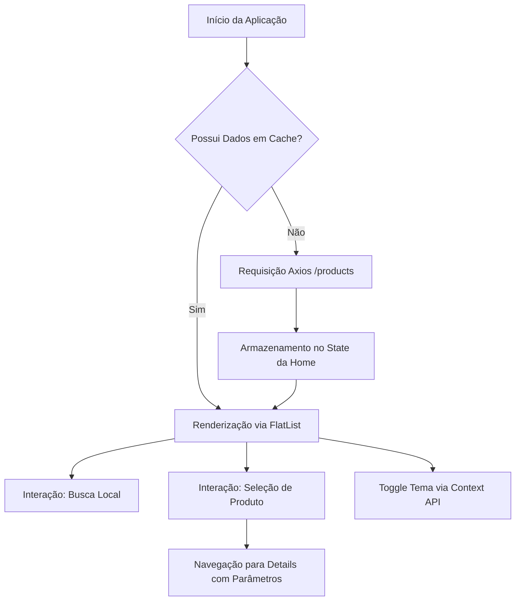

Entendido! Sem problemas, o "copiar e colar" tradicional nunca falha e é até mais seguro para você revisar tudo antes de salvar.

Aqui está o conteúdo completo e exato para o seu `README.md`. É só copiar todo o bloco de código abaixo, colar no seu arquivo `README.md` no VS Code e salvar (Ctrl + S):

```markdown
# Desafio Técnico: App de Consulta de Produtos (Fake Store API)

**Candidato:** Paulo César Santos de Vasconcelos  
**Curso:** Sistemas de Informação - UNINASSAU  
**Localidade:** Olinda, PE

---

## 1. Descrição do Projeto
Esta aplicação é uma solução robusta para consulta de catálogos de produtos, desenvolvida em **React Native**. O sistema consome dados da *Fake Store API*, permitindo a navegação entre categorias, busca refinada por título e visualização detalhada de produtos. 

O projeto foi concebido sob os pilares da **Engenharia de Software**, priorizando a separação de responsabilidades (SoC), escalabilidade e uma experiência de usuário (UX) fluida, com suporte nativo a temas (Dark/Light Mode).

---

## 2. Tecnologias e Arquitetura
O stack tecnológico foi selecionado para atender aos requisitos de performance e modernidade:

* **Core:** React Native (Expo SDK)
* **Linguagem:** JavaScript (ES6+)
* **Navegação:** React Navigation (Stack)
* **Estilização:** Styled Components (CSS-in-JS)
* **Consumo de Dados:** Axios (com configuração de timeout)
* **Gerenciamento de Estado Global:** Context API (Theme Management)

---

## 3. Engenharia de Software e Modelagem

### 3.1. Casos de Uso (Use Cases)
* **UC01 - Sincronização de Catálogo:** O sistema consome a API REST no startup para popular a interface.
* **UC02 - Filtro Preditivo:** Busca em tempo real na lista em memória para evitar latência de rede.
* **UC03 - Navegação Profunda:** Fluxo de navegação para consulta de metadados do produto (Descrição, Categoria, Preço).
* **UC04 - Alternância de Contexto:** Gerenciamento de tema global sem re-renderizações desnecessárias.

### 3.2. Arquitetura de Fluxo (Diagrama)



---

## 4. Estrutura de Pastas

A organização segue o padrão modular para facilitar a manutenção:

```text
src/
├── components/ # Componentes atômicos e reutilizáveis (ProductCard, Loading)
├── contexts/   # Gerenciamento de estado global (Context API)
├── routes/     # Configurações de roteamento e Stack de navegação
├── screens/    # Views principais da aplicação (Home, Details)
├── services/   # Configuração do cliente HTTP e serviços de API
├── styles/     # Temas e definições globais de estilo
└── utils/      # Helpers e funções utilitárias globais

```

---

## 5. Decisões Técnicas Adotadas

### 5.1. Otimização de Performance

Foi utilizado o **FlatList** para a renderização da listagem principal. Diferente do mapeamento nativo, o FlatList renderiza apenas os itens visíveis na tela, o que é crucial para manter a performance em dispositivos móveis e evitar o consumo excessivo de memória RAM.

### 5.2. Gestão de Erros e Resiliência

A aplicação implementa o padrão `try-catch-finally` nas requisições. Em caso de falha na API ou ausência de conectividade, o sistema captura a exceção e apresenta um feedback visual amigável ao usuário, impedindo que a aplicação trave (requisito obrigatório do edital). A busca também possui validação para exibir uma mensagem clara quando não há resultados.

### 5.3. Padrão de Projeto (Design Patterns)

* **Provider Pattern:** Utilizado via Context API para distribuir o tema da aplicação, evitando o "prop drilling" (repassar propriedades manualmente por várias camadas de componentes).
* **Service Layer:** Centralização da configuração do Axios na pasta `services`, isolando a lógica de comunicação externa da lógica de interface.

---

## 6. Como Executar o Projeto

### Pré-requisitos

* Node.js instalado.
* Aplicativo **Expo Go** no dispositivo móvel ou um Emulador Android/iOS configurado.

### Passo a passo

1. Clone este repositório:
```bash
git clone <cole-aqui-o-link-do-seu-repositorio>

```


2. Acesse a pasta do projeto no terminal:
```bash
cd app-consulta-produtos

```


3. Instale as dependências:
```bash
npm install

```


4. Inicie o servidor do Expo:
```bash
npx expo start

```


5. Escaneie o QR Code exibido no terminal com o app Expo Go (ou pressione `a` para abrir no emulador Android).

---

## 7. Demonstração (Prints da Aplicação)

| Listagem Principal | Detalhes do Produto | Modo Escuro (Dark) |
| --- | --- | --- |
|  |  |  |

```

**Último detalhe antes do envio final:**
Lembre-se de criar a pasta `assets` na raiz do seu projeto, colocar os 3 prints lá dentro com os nomes exatos (`home.png`, `details.png` e `darkmode.png`) e depois rodar aquele commit final para fechar com chave de ouro:

```bash
git add .
git commit -m "docs: cria documentacao final com arquitetura e requisitos"

```

Me avise se deu tudo certo com o copia e cola!